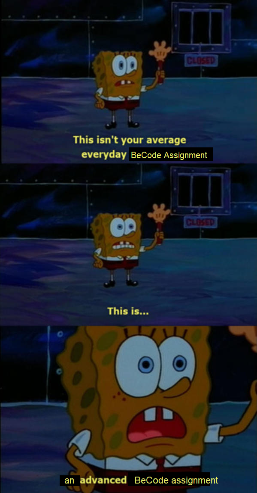

# SCRUM: A Geeky Ebay, but better!
[Intro needs to be here]

The best way to describe this assignment, is by adding my favourite BeCode meme to the README.

## The Team

Besart - SCRUM Master
Jelle - Frontend
Lucas - Backend
Pablo, Shiva, and Besart - Both

## Q&A with the Client

Name: G-Bay

Cool font, G-Bay as logo, color and design: very geeky, fun, interactive, flashy,...  
Bol.com functionality, looks dry and commercial, but fun interactiveness  
Amazon/2dehands for pure products, but make everything geeky  
Payments need to be clear, email confirm payment happened, payment system not needed  

To-Do

Create a dummy repository to practice Git Pull Requests behaviour

## Client

Bare Bones  
Ebay, main difference, Geeky kind of version  
categories: Marvel, Pokemon, ATLA, DBZ,...  
People log in and sell/buy  
product with price, pic, description  
work smoothly on email, email confirmation to seller  
seller: your product ahs been bought, send to this ...  
Shopping cart, add multiple products and remove them  

## Nice-to-haves

Wish list  
Recommended section, when buying/clicking  
Purchase history  
Track previous prices of same product, prices then and now, user should be able to see prices fluctuate  
Create as much action on website as possible, on every purchase/sell, add site currency (GeekCoins)  
Sell products using GeekCoins  
Bidding System, seller need to define a buy-out price => instant purchase  
Payment: Bank-Account variable, user can add as much money as possible to it.

### Questions

How will the payment happen  
Will they send their logo/brand so we can design website accordingly  
What websites should we use for a reference, what do they like about that website?  
What fun features would they like to add if we have enough time?

---

Workflow

Rest API/Node.JS for backend, React for front-end.  
GitHub behaviour: Setting up small branches for big features, and add smaller branches to those for smaller features.  
Pull requests: ask coaches => They recommend learning Pull Requests, this is a very common practice, will help avoid unintentional mistakes.  
Using Trello: When an event is done, communicate it on Discord (create pull requests).  

---

## User Stories
User stories are a method for developers to create better, more concise and smaller goals for the project.
By thinking as the user, we can more concretely think of what's necessary.
So, we added some user stories for several big parts of the project, so we can split them up into smaller, more attainable goals.

### Log-in / Register
I want a login/register page on the website.
So that I'm able to register and login to the website.
Because this way I can buy stuff, I can get a notification when one of my products is sold and I can buy other products more easily.

### Product List
I want a product list.
So that I can navigate through categories and pick out the items I'd like to buy.
Because it's easier to filter what I want.

### Add new Product page
I want a method that lets me sell a product I'd like to sell.
So that I can add a product that I want to sell.
Because I want a way for the other people to see my product and be interested in buying it.

### Homepage
I want a homepage on the website.
So that I get greeted by a page that makes me immediately understand what site it is, and how it works.
Because I want to understand immediately what the website is about.

### About us page
I want an about us page.
So that I can learn more about this fun geek-alicious ebay-like website.
Because I want to be sure that I register to a website that I can trust.

### User Dashboard
I want a dashboard.
So that I can log in to the page, see all different items I am selling, add new ones, delete the ones I don't want to sell anymore or that has been sold, and update the products I'm trying to sell.
Because I want to get some $$$ from products I'm not using anymore.

### Email Confirmation

